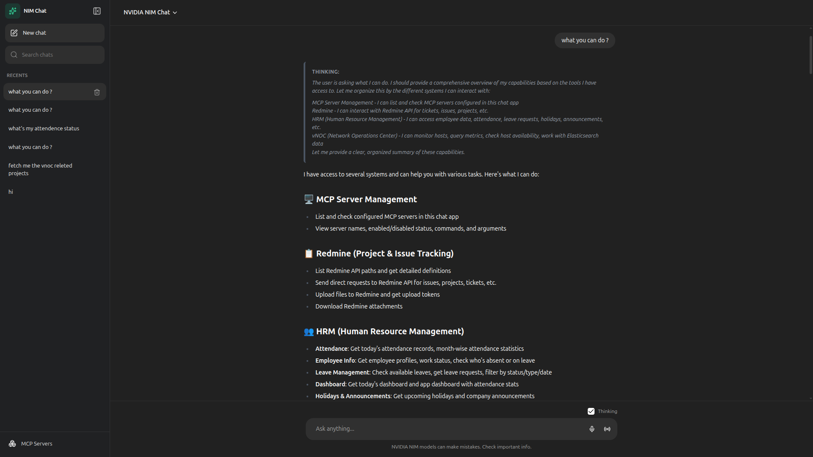
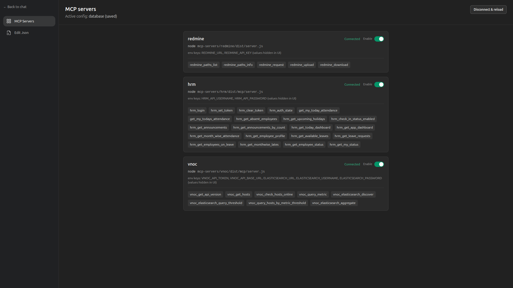

# MCP Client

A ChatGPT-style web client for **[NVIDIA NIM](https://docs.nvidia.com/nim/)** (OpenAI-compatible chat completions), built with **Next.js 14**, **SQLite** persistence, and optional **MCP (Model Context Protocol)** tool calling—including a built-in tool to list configured MCP servers.




## Features

- **NIM proxy** — API keys and model id stay on the server; the browser only talks to your Next.js app.
- **Streaming replies** — Token streaming over SSE, with optional reasoning / “thinking” display when the model supports it.
- **Conversations** — Multi-turn chats stored in SQLite (titles, sidebar, search, new/delete chat).
- **MCP tools** — When enabled, the model can call stdio MCP servers you define. Per-server **on/off** toggles and a **Monaco JSON editor** under `/mcp` (config stored in the database, not on disk).
- **Built-in `nim_host__list_mcp_servers`** — Lets the assistant list MCP servers configured in this app (names, enabled state, command) without guessing.

## Requirements

- **Node.js** 18+ (20+ recommended)
- A running **NIM** deployment that exposes an **OpenAI-compatible** chat completions URL (same shape as `/v1/chat/completions` with streaming).
- For MCP subprocess servers: **Node** (or whatever your MCP `command` needs) on the machine running Next.js.

## Quick start

From the repository root (after `git clone`):

```bash
npm install
```

Create `.env.local` in the project root (see [Environment variables](#environment-variables)), then:

```bash
npm run dev
```

Open **http://localhost:3000**.

Production:

```bash
npm run build
npm start
```

If you use Yarn, `yarn install`, `yarn dev`, `yarn build`, and `yarn start` work the same way.

To use the **bundled MCP servers** in `mcp-servers/`, install and build each one you need before configuring `/mcp` (see [Bundled MCP servers](#bundled-mcp-servers-mcp-servers)).

## Environment variables

Set these on the **server** (e.g. `.env.local` for local dev). They are never sent to the browser.

| Variable              | Required | Description                                                                                     |
| --------------------- | -------- | ----------------------------------------------------------------------------------------------- |
| `NIM_CHAT_URL`        | Yes      | Full URL to NIM chat completions (e.g. `https://integrate.api.nvidia.com/v1/chat/completions`). |
| `NIM_API_KEY`         | Yes      | Bearer token for NIM.                                                                           |
| `NIM_MODEL`           | No       | Model id; defaults to `meta/llama-3.1-8b-instruct` if unset.                                    |
| `NIM_THINKING_PARAMS` | No       | Set to `0` to **omit** `chat_template_kwargs.enable_thinking` if your endpoint rejects it.      |
| `SQLITE_PATH`         | No       | SQLite file path; default is `./data/chat.db` under the project.                                |
| `MCP_TOOLS_ENABLED`   | No       | Set to `0` to disable MCP tool use in chat entirely.                                            |

Secrets for MCP servers (for example `REDMINE_API_KEY`) can be set in `.env.local` and referenced from your MCP JSON **env** block, or stored only in the JSON you paste in **Edit Json** (values are masked in the MCP UI).

## MCP configuration

1. Open **`/mcp`** (or use **MCP Servers** in the chat sidebar).
2. Use **Edit Json** to paste a Cursor-style document with a top-level **`mcpServers`** object. Example shape:

```json
{
  "mcpServers": {
    "my-server": {
      "command": "node",
      "args": ["/absolute/path/to/mcp/dist/server.js"],
      "env": { "API_KEY": "..." }
    }
  }
}
```

3. **Save to database** — Configuration is stored in SQLite (`mcp_config`). There is no separate on-disk `mcp.json` path for the app runtime.
4. Use the **Enable** switch per server to set `"disabled": true` without deleting the entry.
5. **`nim_host__list_mcp_servers`** is always registered when MCP mode is active so vague questions like “list MCP servers” can be answered from real data.

Stdio MCP only (same as Cursor’s local servers): each entry needs a **`command`**; optional **`args`**, **`env`**, **`cwd`**.

## Bundled MCP servers (`mcp-servers/`)

This repo ships **three optional stdio MCP connectors** as separate Node/TypeScript packages. The web app does **not** build them automatically: you must **install dependencies and compile** each server you want, then register the **built JavaScript** path in the MCP JSON (see [MCP configuration](#mcp-configuration)).

| Connector | Directory | Stdio entry after `npm run build` | Docs |
| --------- | --------- | ----------------------------------- | ---- |
| Horila HRM | `mcp-servers/hrm` | `dist/mcp/server.js` | [mcp-servers/hrm/README.md](./mcp-servers/hrm/README.md) |
| vNOC | `mcp-servers/vnoc` | `dist/mcp/server.js` | [mcp-servers/vnoc/README.md](./mcp-servers/vnoc/README.md) |
| Redmine | `mcp-servers/redmine` | `dist/server.js` | [mcp-servers/redmine/README.md](./mcp-servers/redmine/README.md) |

**Build every connector you use** (from the repo root or from each folder):

```bash
cd mcp-servers/hrm && npm install && npm run build && cd ../..
# repeat for vnoc and/or redmine as needed
cd mcp-servers/vnoc && npm install && npm run build && cd ../..
cd mcp-servers/redmine && npm install && npm run build && cd ../..
```

Or one-liners from the repository root:

```bash
(cd mcp-servers/hrm && npm install && npm run build)
(cd mcp-servers/vnoc && npm install && npm run build)
(cd mcp-servers/redmine && npm install && npm run build)
```

Each `mcp-servers/*` folder has its own lockfile; `yarn install && yarn build` works there too if you prefer Yarn.

Use an **absolute path** in `args` to the compiled file above (the Next.js server runs on the same machine that must run `node`). Example for HRM after building:

```json
{
  "mcpServers": {
    "hrm-mcp": {
      "command": "node",
      "args": ["/absolute/path/to/mcp-servers/hrm/dist/mcp/server.js"],
      "env": { }
    }
  }
}
```

Fill `env` per the connector README (API URLs, tokens, etc.). **HRM** and **vNOC** use `npm run mcp` for a local stdio run after build; **Redmine** uses `npm start` (or `node dist/server.js`).

## Project layout (high level)

```
├── src/app/              # Next.js App Router (pages, API routes)
├── src/components/       # React UI (chat, MCP, shadcn/ui)
├── src/hooks/            # Client hooks (chat session)
├── src/lib/              # Shared client utilities
├── src/server/           # NIM proxy, MCP, SQLite
├── data/                 # Default SQLite directory (gitignored db files)
├── public/               # Static assets
└── mcp-servers/          # hrm, vnoc, redmine — build separately (see above)
```

## API routes (overview)

- `POST /api/chat` — Chat completion (NIM stream, or MCP agent + stream when configured).
- `GET|POST|PATCH|DELETE /api/conversations` — Conversation CRUD.
- `GET|PUT /api/mcp/config` — Read/write MCP JSON in the database.
- `GET /api/mcp/servers` — List configured servers and tool discovery status.
- `PATCH /api/mcp/servers/[name]` — Toggle a server enabled/disabled (`disabled` flag).
- `POST /api/mcp/reload` — Drop in-memory MCP clients after config changes.

## Troubleshooting

- **503 / “Set NIM_CHAT_URL and NIM_API_KEY”** — Add both variables and restart `npm run dev`.
- **MCP tools not used** — Ensure saved JSON has `mcpServers`, at least one enabled server with a valid `command`, and that `MCP_TOOLS_ENABLED` is not `0`.
- **MCP server fails to start** — Run `npm install` and `npm run build` in that connector’s folder (`mcp-servers/...`), use an **absolute** path to the built `dist/...js` file in `args`, and match the entry in the table under [Bundled MCP servers](#bundled-mcp-servers-mcp-servers).
- **400 from NIM on thinking** — Set `NIM_THINKING_PARAMS=0`.
- **SQLite** — Ensure the process can create/write `data/` (or set `SQLITE_PATH` to a writable file).

## Tech stack

Next.js 14 · React 18 · Tailwind CSS · shadcn/ui (Radix) · better-sqlite3 · `@modelcontextprotocol/sdk` · Monaco Editor · react-markdown

## License

MIT
